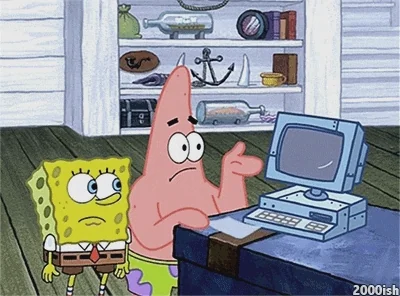

  

  
  <h1>
  Hey there!
  
  
  </h1>

### :woman_technologist: About Me :
- I am a Full-Stack Software Engineering student at Holberton School Australia - Cohort 23 
- :telescope: I’m currently working on an Airbnb clone called "Hbnb Evolution".

- :seedling: Currently learning Python, HTML, CSS, and JavaScript.

- :volleyball: In my free time, I play indoor and beach volleyball.

- :mailbox:How to reach me: 

---

### :hammer_and_wrench: Languages and Tools :

  &nbsp;
  &nbsp;
  &nbsp;
  &nbsp;
  &nbsp;
  

---

### :fire: My Stats :
&nbsp;&nbsp;&nbsp;&nbsp;

---

### :headphones: Now Playing :

